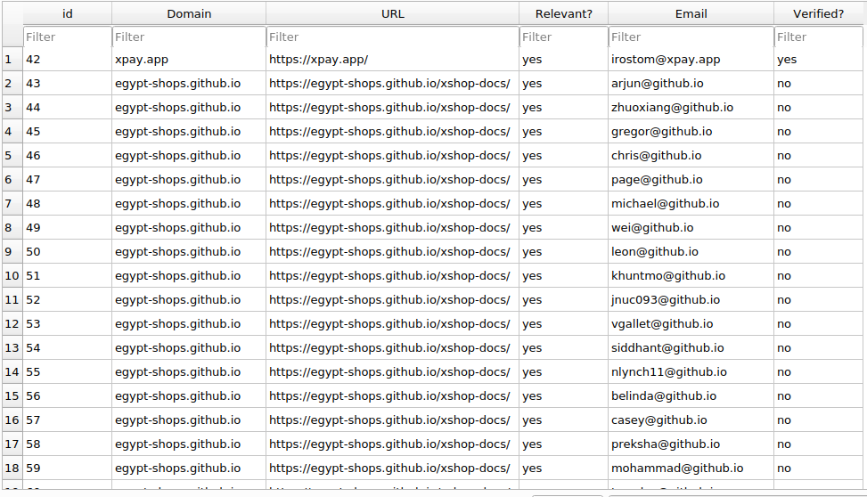

# Scripting Assignment

Read urls from sheet.csv and get emails found in their domain then save them to sqlite db.

## Run on Ubuntu

- create a python venv then activate it
- `$ pip install -r requirements.txt`
- Prepare the database using [sqlitebrowser](https://sqlitebrowser.org/dl/)
- run `$ python main.py`

## Example output

